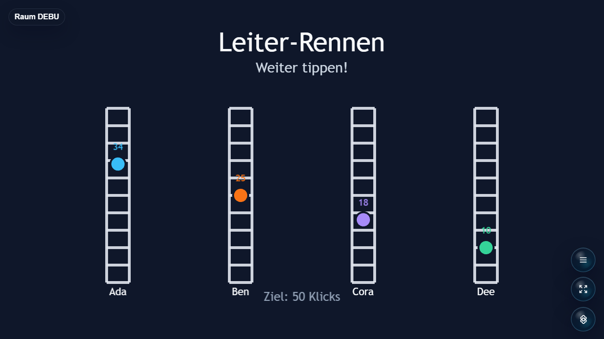

# Open Party Lab: Tap Race

Tap Race is a small Open Party Lab game package. Players tap as fast as possible on their phone controller while the shared host screen renders the race.

## Screenshot



## Local Development

Recommended folder layout:

```text
Open-Party-Lab/
  local-games/
    open-party-game-tap-race/
```

Install and build this game:

```bash
npm install
npm run typecheck
npm run build
```

For local Platform integration, run this in the Party Platform repo:

```bash
cd ../..
npm run games:sync-local
npm run dev:all
```

The Platform links only game repos that exist locally. If this repo is not present, Tap Race is skipped.

## Public Entrypoints

```text
@open-party-lab/game-tap-race/manifest
@open-party-lab/game-tap-race/protocol
@open-party-lab/game-tap-race/server
@open-party-lab/game-tap-race/host
@open-party-lab/game-tap-race/controller
```

## Browser Note

Chromium-based browsers and Safari are recommended for phone controllers. Firefox may have issues around fullscreen, reconnect/session handling, or touch timing.
